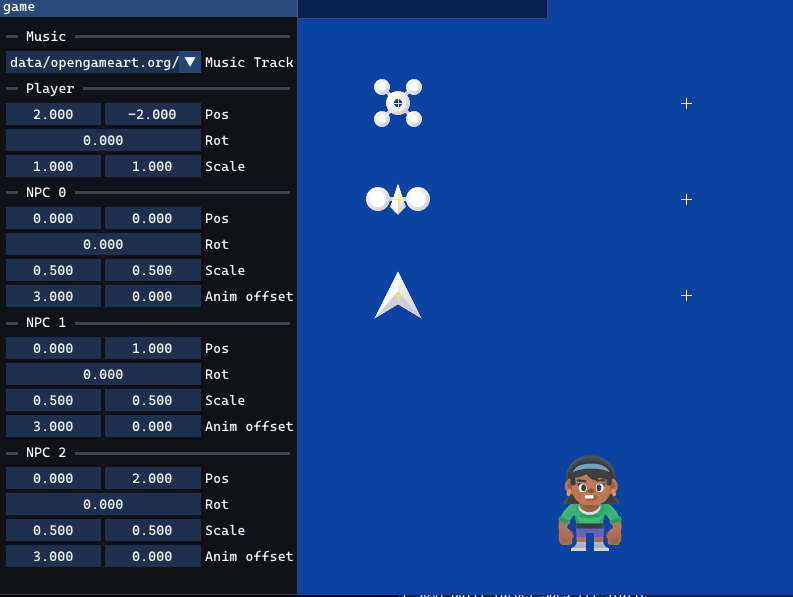

# Exercise 05 - Animation and Audio
This week we'll have a slightly easier exercise, focusing on sprite-based animation, easing and audio.

## 05.0 Exercise review
The review will focus on the API of SDL_mixer, and checking that everyone can run it properly. We will also look at some of the new functions and libraries added to the repo this week.

## 05.1 Sprite-based animation
- flip sprite based on movement direction
- when the player moves, cycle through the "walk" sprites (`character_femalePerson_sheet.xml` will tell you precisely where each frame is located)
- tweak the sprite animation speed based on the player horizontal velocity, in order to avoid feel sliding (you can change the values manually through the UI, but ideally we would like to express tha animation speed in function of the movement speed, so that everything still works with acceleration, within reasonable ranges)

## 05.2 Linear interpolation and easing
- make the 3 NPCs move from their initial position to their target using interpolation
    - compute a starting and ending position based on the transform and the given offset
    - find a way to express the linear interpolation parameter `t` (hint: it will involve the desired speed and the travel distance)
    - during update, set the NPCs position based on a linear interpolation of their start and end position
- add different easings to the different NPCs and see how they compare with each other. You can either
    - implement your own (check [easigns.net](easings.net) for inspiration and refere equations)
    - check the `easing` function and related code in `itu_common.hpp`

## 05.3 Audio
- add sliders to the UI to control volume (gain). As most games, we will want a slider to contorl the total volume and one for the music
- using the background music as an example, load and play footsteps sound effects whenver the player animation shows a footstep
- make the main music looping (hint: check `MIX_PlayTrack` API)
- add cross-fade when changing music
